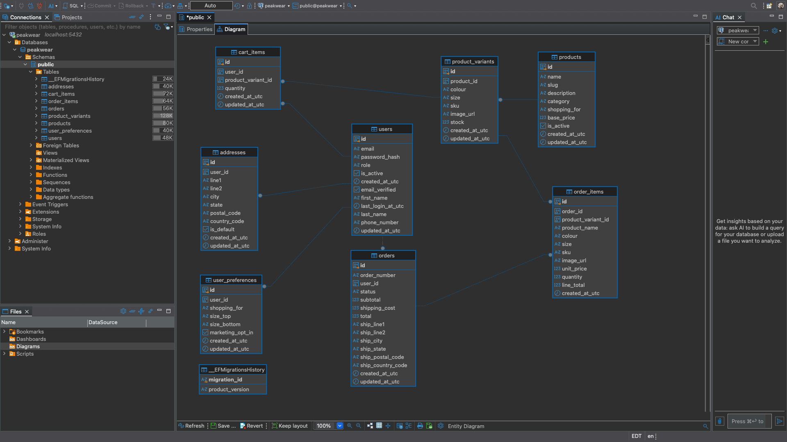

# PeakWear

A full-stack e-commerce app for athletic wear — .NET 10 API, Angular 22 frontend, PostgreSQL, JWT auth, and an AI-powered size recommender.

I work in this stack professionally. I built PeakWear to have something end-to-end I could point at, and to work with LLM integration properly rather than just reading about it. That last part was genuinely new to me and it's where most of the interesting problems turned up.


---

## Why this project

Most portfolio apps stop at CRUD. I wanted the problems that only show up in a real domain.

**Product variants.** A pair of leggings isn't one sellable thing — it's nine, one per colour and size, each with its own SKU and stock count. Getting that wrong means rewriting the cart, checkout and every stock check later, so it was the first thing I got right.

**AI that isn't a gimmick.** A chatbot on a clothing store answers questions the FAQ already covers. Size recommendation solves an actual problem: wrong size is the most common reason for apparel returns. It sits behind a provider-agnostic interface, validates what the model returns against sizes that really exist, and falls back to a deterministic calculation when the API is unavailable.

**Money and stock that behave correctly.** Order lines snapshot the price at purchase, so repricing a product doesn't rewrite history. Checkout decrements stock inside a transaction, with a concurrency token catching two people racing for the last item.

---

## Stack

**Backend**
- .NET 10 / C# 14, ASP.NET Core Web API
- EF Core 10 for writes, CRUD and migrations; Dapper available for complex reads
- PostgreSQL 16
- JWT auth with BCrypt password hashing
- Scrutor for DI auto-registration

**Frontend**
- Angular 22 — zoneless, signal-first
- NgRx SignalStore
- Angular Material
- Reactive forms

**AI**
- Groq (`openai/gpt-oss-20b`) behind a provider-agnostic interface

---

## How it's structured

```
api/
├── PeakWear.Api/       Controllers, DI wiring, HTTP pipeline
├── PeakWear.Core/      Models, services, interfaces — no dependencies
└── PeakWear.Data/      Repositories, DbContext, migrations, AI clients

ui/src/app/
├── core/auth/          Token service, HTTP interceptor, route guard
├── modules/
│   ├── login/          Auth store, login and register
│   ├── products/       Product store, list, detail, size recommender
│   ├── cart/           Cart store and page
│   ├── orders/         Checkout, confirmation, order history
│   ├── account/        Profile, addresses, preferences
│   └── home/           Landing page
└── shared/
```

The API references run one way: `Api → Core`, `Api → Data`, `Data → Core`. Core references nothing, so business logic can't accidentally depend on the database — that's enforced by the compiler rather than by discipline.

Two model types per entity, deliberately. `DbModels/User.cs` mirrors the table and holds the password hash. `Models/UserResponse.cs` is what the API returns and doesn't have that property at all. The service maps between them, so the hash can't leak into a response by accident.

---

## Data model

```
users ──┬── user_preferences   (1:1)
        ├── addresses          (1:many, one default enforced by a partial unique index)
        ├── cart_items         (1:many, unique on user + variant)
        └── orders ── order_items   (1:many, prices and names snapshotted)

products ── product_variants   (1:many, unique on product + colour + size)
```

Stock lives on the variant, not the product — you can sell out of black-medium while blue-medium is fine.

Order items copy the product name, colour, size, SKU and price rather than joining back to the catalogue. An order is a historical record: if a product is renamed, repriced or deleted, past orders have to keep showing what was actually bought and what was actually paid.

<!--  -->

---

## What it does

**Browse and select**

Products are listed by section with colour swatches. On the detail page, choosing a colour swaps the image and re-evaluates which sizes are actually available — sizes that are out of stock in that colour disable themselves rather than failing at checkout.


**Size recommendation**

Height, weight, build and fit preference go to the API, which builds a prompt from the product's real available sizes and returns a recommendation with reasoning. The suggested size feeds straight into the size selector, so accepting it is one click.

**Bag and checkout**

Adding to the bag validates against remaining stock. A signed-out shopper who clicks Add to bag doesn't lose the item — the intent is held in `sessionStorage` through the login redirect and applied once they're authenticated.

Checkout picks from saved addresses, defaulting to the one marked default. Placing the order decrements stock, creates the order and empties the cart in a single transaction.


**Account**

Profile details, multiple addresses with default handling, shopping preferences, and password change. Order history shows what was bought at the price it was bought for.


---

## Running it locally

You'll need .NET 10, PostgreSQL 16, and Node 22.

```bash
# database
createdb peakwear
psql peakwear -c "CREATE USER peakwear_app WITH PASSWORD 'devpassword123';"
psql peakwear -c "GRANT ALL PRIVILEGES ON DATABASE peakwear TO peakwear_app;"
psql peakwear -c "GRANT ALL ON SCHEMA public TO peakwear_app;"

# secrets — stored outside the repo, never committed
cd api/PeakWear.Api
dotnet user-secrets set "ConnectionStrings:Default" \
  "Host=localhost;Port=5432;Database=peakwear;Username=peakwear_app;Password=devpassword123"
dotnet user-secrets set "Jwt:Key" "$(openssl rand -base64 48)"
dotnet user-secrets set "Jwt:Issuer" "peakwear-api"
dotnet user-secrets set "Jwt:Audience" "peakwear-web"
dotnet user-secrets set "Groq:ApiKey" "your-groq-key"   # console.groq.com, free

# schema — products seed themselves on first run
cd ..
dotnet ef database update --project PeakWear.Data --startup-project PeakWear.Api
dotnet watch --project PeakWear.Api

# frontend, in another terminal
cd ../ui && npm install && ng serve
```

API on `:5248`, UI on `:4200`, API docs at `http://localhost:5248/scalar/v1`.

---

## Where it's at

**Working**
- [x] Three-project solution with compiler-enforced layering
- [x] EF Core migrations — the schema lives in git, not just on my laptop
- [x] Registration and login: BCrypt hashing, JWT issuing and validation
- [x] HTTP interceptor attaching the token; a 401 clears the session and redirects
- [x] Route guards with a returnUrl round-trip
- [x] Products and variants — colour × size matrix with per-variant stock and SKUs
- [x] Product list and detail with colour swatches and size availability
- [x] Cart with stock validation, quantity controls and a header badge
- [x] Deferred add-to-bag — a signed-out shopper's item survives the login redirect
- [x] AI size recommender behind a provider-agnostic interface
- [x] Account management: profile, addresses, preferences, password change
- [x] Checkout with transactional stock decrement and price snapshotting
- [x] Order confirmation and order history
- [x] Angular frontend deployed to GitHub Pages

**Next**
- [ ] Deploy the API and database so the live site actually has data behind it
- [ ] Payment via Stripe test mode
- [ ] Docker Compose for the whole stack
- [ ] CI/CD

**Deliberately not built**

Admin screens. I've built plenty of CRUD interfaces professionally and the time was better spent on the parts I hadn't done before. In a real system this is how data gets changed at all — a product manager gets an admin screen, not a database client — so it's an omission I'd fill first on a real product.

**Known gaps**

These are trade-offs I made knowingly rather than things I missed.

- **Token in `localStorage`.** Simple, but readable by any injected script. The current recommendation is an in-memory access token plus a refresh token in an HttpOnly cookie. All storage access is isolated in one service so the change is cheap when I make it.
- **No token refresh.** An expired session just logs you out mid-flow.
- **Stock isn't reserved at add-to-cart.** Two people can hold the last item; the real check happens in the checkout transaction. That matches how most stores behave, but it means someone can lose the item at the final step.
- **No guest cart.** Login is required to add to the bag, softened by the deferred add-to-bag flow.
- **No pagination or search.** Fine at eight products, wrong at eight hundred.
- **No password reset.** Needs an email provider, single-use hashed tokens with short expiry, and the same don't-confirm-whether-the-email-exists rule as login.
- **AI calls aren't cached or rate limited.** Identical inputs cost two API calls, and nothing stops a script exhausting the free quota.

---

## Things that went wrong

The parts I actually learned from.

**A route guard is not a security feature.** It's client-side, so anyone can fake a token in `localStorage` and make the page render. The real protection is `[Authorize]` on the API — the page loads and then every request comes back 401. Guards are for user experience.

**"CORS is broken" was a middleware ordering bug.** The browser's preflight `OPTIONS` request carries no token, so authentication was rejecting it before CORS ever ran. Moving `UseCors` above `UseAuthentication` fixed it. I'd have spent a lot longer on this if I'd kept looking at the CORS policy itself.

**The AI provider abstraction paid for itself within a day.** I built the size recommender against Gemini. The model I'd targeted had been renamed; then Google's API key format changed mid-migration and my account could only issue credentials their own endpoint rejected. Swapping to Groq cost one new class and one DI registration, because the prompt builder, the validation and the controller all depended on `ISizeRecommendationClient` rather than a vendor. I'd argued for the interface on testability grounds — it earned its place on portability instead.

**Model output is untrusted input.** Asked to pick from S, M and L, a model will occasionally return XL, or "Medium" instead of "M". The recommendation is validated against the product's real variants before it goes anywhere near the UI.

**A C# default isn't a database default.** `Role = "Customer"` on the model only applies when EF constructs the object. A raw SQL insert bypasses C# entirely, and the column came back null against a NOT NULL constraint.

**Dapper silently returned empty strings.** Postgres uses `display_name`, C# uses `DisplayName`, and Dapper can't bridge snake_case to PascalCase on its own. `id` and `email` mapped fine, so it looked like a data problem rather than a mapping one.

**Rotating a JWT signing key logs everyone out silently.** The frontend still believes it's authenticated because `localStorage` looks fine; every request just 401s. That's what prompted the 401 interceptor.

**Two package version conflicts.** The project template shipped a dependency with a published CVE, and the latest major version broke the build through a source generator. Both times the fix was adding the package explicitly at the version I wanted — a direct reference beats a transitive one.

**Three Node installations fighting over PATH.** Homebrew, nvm, and the nodejs.org installer, with an odd-numbered version winning. `which -a node` is the command I wish I'd known sooner.

---

## Notes

Commands I use day to day are in [docs/COMMANDS.md](docs/COMMANDS.md).

Product photos are placeholders from free stock libraries and aren't PeakWear's own.
